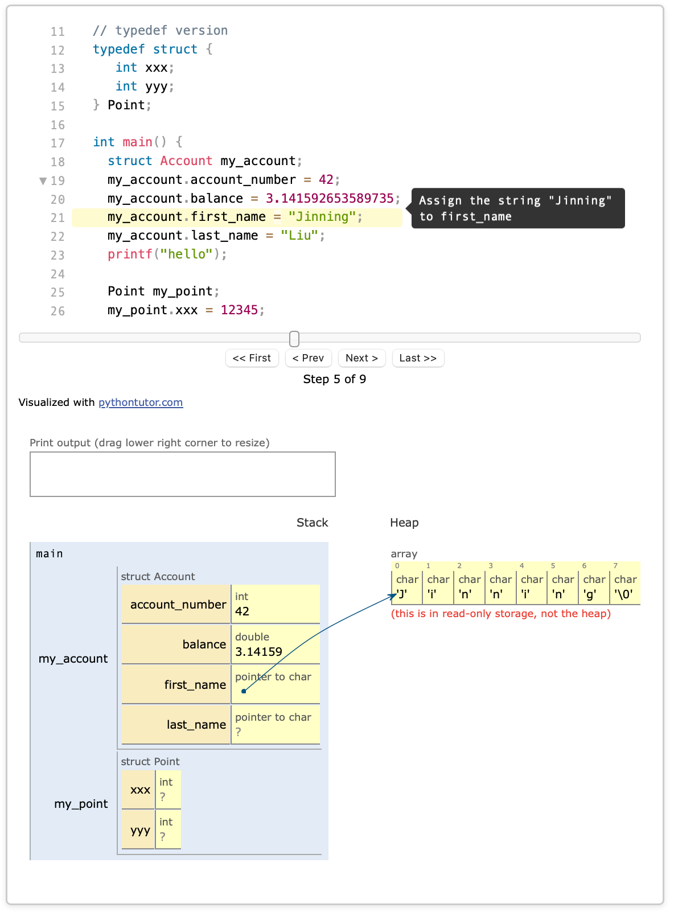

# pythontutor-c-webcomponent

[](https://github.com/JinningL/pythontutor-c-webcomponent)

A web component for visualizing **C code execution** with an enhanced [Python Tutor](https://pythontutor.com/) engine.  
Supports **inline annotations**, **code folding**, and **HTML to trace.json extraction** for textbook embedding.

---

## 📸 Demo

Code execution visualization with inline annotations and heap/stack view:


 

[](https://JinningL.github.io/pythontutor-c-webcomponent/test-component.html)
---

## ✨ Features

- **Easy Embed** — One `<c-visualizer>` tag shows the full execution visualization.
- **C Language Support** — Backend generates execution traces for C programs.
- **Annotation Support** — Show step-by-step tooltips using JSON.
- **Code Folding** — Collapse and expand code sections for cleaner view.
- **Syntax Highlighting** — Highlight code syntax automatically for better readability.

---
## 🛠 Usage
### 1) Install dependencies
```bash
pip install beautifulsoup4
```

### 2) Set the HTML file name in the script
```bash
HTML_FILE = "test-component.html"   # Change to your HTML file name
BACKEND_SCRIPT = "backend.py"       # Backend script (keep in the same directory)
```
### 3) Run the script to generate trace.json
```bash
python run_and_visualize.py
```

The script will:
- Scan the HTML for `<c-visualizer>` tags
- Read the `chapter` / `example` attributes
- Save the extracted code to `example/<chapter>/example<example>/code.c`
- Call `backend.py` to generate the `trace.json`

### 4) Include scripts in your HTML

#### **Option A: CDN**  
You can load the visualizer scripts either from **CDN** (recommended for production) or from **local build files**.
 
```html
<!-- Core visualization logic -->
<script src="https://cdn.jsdelivr.net/gh/JinningL/pythontutor-c-webcomponent@v0.1.0/build/improved-visualize.js"></script>

<!-- Web Component registration -->
<script type="module" src="link_to_be_created"></script>
```

#### **Option B: Local files**  
```html
<script src="build/improved-visualize.js"></script>
<script type="module" src="build/smth"></script>
```
#### **Minimal HTML example**
```html
<!doctype html>
<html>
<head>
  <meta charset="utf-8" />
  <!-- Use one of the script loading options above -->
</head>
<body>
  <c-visualizer chapter="chapter1" example="1" lang="c">
      <script type="application/json" data-kind="annotation">
        {
          "annotation": {
            "2": "This line prints 'Hello, world!'"
          },
          "folds": [
            { "start": 1, "end": 2 }
          ]
        }
        
      </script>
      #include &lt;stdio.h&gt;
      int main() {
        printf("Hello, world!");
        return 0;
        }      
      
    </c-visualizer>
</body>
</html>
```

**Note:**  
1. `<c-visualizer>` will request the file at `example/<chapter>/example<example>/trace.json`.  
2. Replace `<chapter>` with your chapter name (e.g., `chapter1`) and `<example>` with your example number (e.g., `1`).
3. In HTML, certain characters like < and > in code or text content must be written as `&lt;`; and `&gt;`; so that they are displayed correctly instead of being interpreted as HTML tags.
4. Both annotation and folds are optional. If omitted, the visualization will still run normally without step tooltips or code folding.

---
## 📂 Project Structure

```plaintext
pythontutor-c-webcomponent/
├── build/                     # Compiled JS/CSS assets
├── example/                   # Generated code + trace 
│   └── chapter1/example1/
│       ├── code.c
│       └── trace.json
├── backend.py                  # Python Tutor C backend
├── run_and_visualize.py        # Parse HTML & run backend to generate trace
├── test-component.html         # Demo HTML with <c-visualizer>
├── LICENSE
└── README.md
```
---
## 🐞 Contact

If you encounter any bugs or issues, please [open an issue](https://github.com/JinningL/pythontutor-c-webcomponent/issues) or contact me directly at **imjinning.liu@mail.utoronto.ca**.
